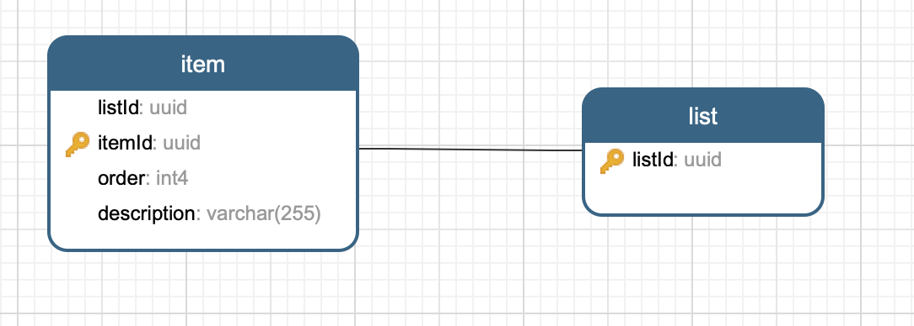
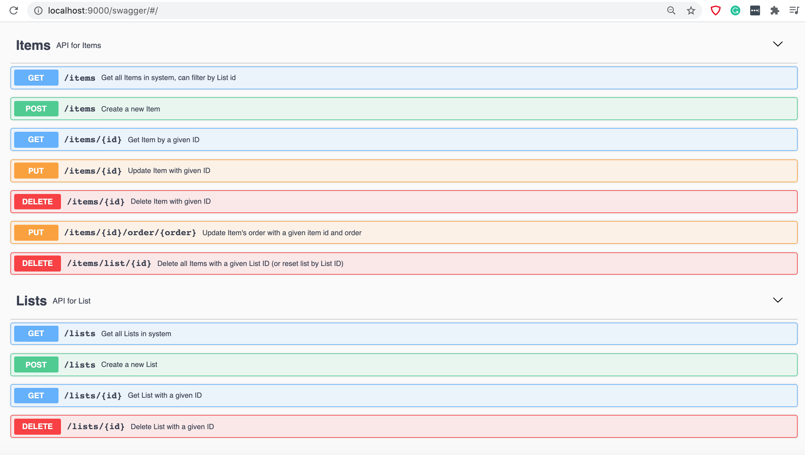

# Setup Express and React to fetch data from Giphy

## Development

## Prerequisites
The following table lists _hard_ dependencies you will need to use this project.

| Name                                                                                       | Version      | Notes                                        |
|--------------------------------------------------------------------------------------------|--------------|----------------------------------------------|
| [docker](https://www.docker.com/products/docker-desktop)                                   | 18.02.0+     | Required to build and spin up services       |
| [docker-compose](https://docs.docker.com/compose/install/)                                 | 1.20.0+      | Required to build and spin up services       |
| [Node](https://nodejs.org/en/download/)                                                    | 14.16        | Required if running locally or running tests |
| [yarn](https://yarnpkg.com/)                                                               | 1.22.5       | Required if running locally or running tests |

### Useful commands

| Command         | Description                                                                                   |
| ----------------| ----------------------------------------------------------------------------------------------|
| stop            | Stops running containers for either `make watch`                                              |
| watch           | Builds, starts, and watches for changes in the service                                        |     

### Migration Script

Migration Script runs through docker compose by `make start`, 
more info to [run migrations](https://github.com/golang-migrate/migrate/blob/master/database/postgres/TUTORIAL.md).

Install migration script manually on Macbook:
```
brew install golang-migrate
migrate create -ext sql -dir api/db/migrations -seq create_list_table
migrate create -ext sql -dir api/db/migrations -seq create_item_table
```

## Assumptions 

- If list does not exist, create new list with a prompt that new list is created
- Add new item to the list
- remove new item from the list
- Items can be reordered 
- The list can be reset
- It is autosave after each action, such as reorder and update the description
- Added item should immediately appear in list with a pending mark. The mark should dissapear as soon as server confirms successful add
- There should be a retry on failed saves (it is not implemnted to save time)
- Server should respond with proper error messages when there is an issue
- Share type definitions between backend and frontend

# ER Diagrams
- List has id 
- Item has description, order and id

## Install packages

For backend:
```
cd api
npm install
```

for frontend:
```
cd client
npm install
```

## Run

To run postgres, migration script, backend api, frontend in watch mode
```
make watch
```

Then visit http://localhost:9000/swagger/#/ and http://localhost:3000/

Check the storybook of existing components:
```
cd client
npm run storybook
```


## End-to-end test for back-end:
```
cd end-to-end-tests
yarn test
```

# Screenshots 



# UI Video 
https://drive.google.com/file/d/1YfoMXRX32lKDngewdCXw2wDyxaZPGkem/view?usp=sharing


# Todo
- prompt user that a new list is created
- Added item should immediately appear in list with a pending mark. The mark should dissapear as soon as server confirms successful add
- There should be a retry on failed saves
- Server should respond with proper error messages when there is an issue
- Written in Typescript and share type definitions between backend and frontend
- Add Better error handeling for BE i.e. if cannot set non unique order in DB 
- Add unit test for Backend 
- Add unit test for frontend